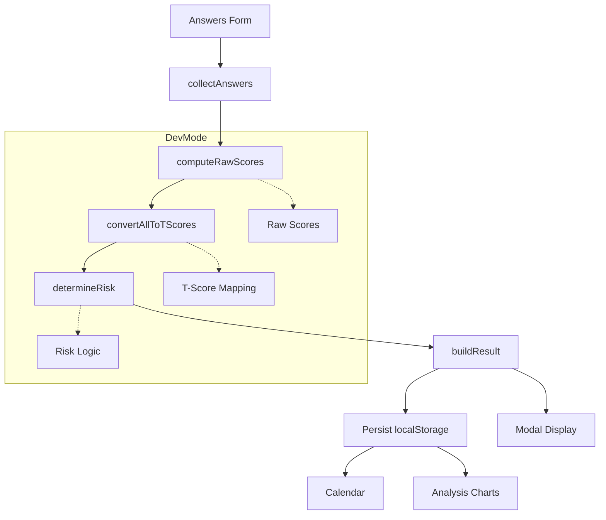

# CARS – Children and Adolescents Risk Screener

Version: 0.9.0 (Beta)  
Status: Beta (feature-complete core; documentation & testing maturation in progress)

CARS is a learner‑focused, browser‑only self‑assessment and tracking tool for Grade 9+ learners. It helps a learner record monthly experiences, converts raw answers into standardized T‑scores, and classifies overall support tier risk levels. All data stays locally in the learner’s browser (no accounts, no server, no analytics).

> The application is intentionally written in plain HTML/CSS/JS with clear separation of concerns so it can be used as a teaching aid for fundamental programming concepts (arrays, aggregation, lookup tables, conditional logic, visualization).

## Quick Start (English)
1. Open the site (GitHub Pages or local `index.html`).
2. Answer each item (English + Filipino shown). Default answers are "Never/No".
3. Click "View My Results" to see the score summary and risk level.
4. Visit Calendar to review any past day’s submission.
5. Use Analysis to view trends (line chart) and latest snapshot (radar chart).
6. Export a JSON backup or a CSV summary from Data Management.

## Mabilis na Pagsisimula (Filipino)
1. Buksan ang site (GitHub Pages o lokal na `index.html`).
2. Sagutan ang bawat tanong (English + Filipino). Default ay "Never/No".
3. I‑click ang "View My Results" para makita ang buod at risk level.
4. Pumunta sa Calendar para balikan ang datos sa mga nakaraang araw.
5. Gamitin ang Analysis para makita ang mga pagbabago (line chart) at pinakahuling snapshot (radar chart).
6. I‑export ang JSON backup o CSV summary sa Data Management.

## Key Features
- 25 bilingual (EN/Fil) self‑report items (item #25 special: self‑harm thoughts)
- Subscales: Externalizing, Internalizing, Social, Academic/Learning, Total
- Raw → T‑score conversion via normative lookup tables
- Tiered risk classification with self‑harm override
- Local persistence (localStorage) with import/export (JSON + CSV)
- Calendar history with clickable day recall
- Trend (line) and snapshot (radar) visualizations using Chart.js
- Dev Mode (toggle or `#dev` or Ctrl+D) for instructional transparency
- Zero backend: privacy by local design

## How It Works
1. Learner selects radio options (0–4 or Yes/No for item 25).
2. Raw scores are summed per subscale and total.
3. Raw scores map to T‑scores via scale‑specific tables (clamped if out of range).
4. Total T‑score (and self‑harm item) determines risk tier.
5. Result object is saved; UI updates calendar & charts.
6. Optional: Dev Mode displays internal pipeline details for teaching.

### Data Flow Diagram
See `/docs/diagrams/flow.mmd` (Mermaid source). A rendered image can be added later.

## Architecture Overview
Modules (under `js/`):
- `data.js` – Questions, rating options, scales, T-score tables, thresholds, schema version
- `scoring.js` – Pure scoring pipeline (collection → raw → T → risk → result)
- `storage.js` – Local persistence + import/export + delete
- UI: `ui_questionnaire.js`, `ui_modal.js`, `ui_calendar.js`, `ui_analysis.js`
- `devmode.js` – Optional transparency panel
- `main.js` – Orchestrates initialization and event wiring

Details in `ARCHITECTURE.md`.

## Risk Classification (Summary)
- Normal/No Risk: Total T ≤ 60
- At-risk: 61–70
- High risk: ≥ 71 OR self-harm item marked "Yes"
Self‑harm affirmative answer immediately sets High risk regardless of Total T.

Full logic: `SCORING_AND_RISK.md`.

## Privacy (Short Form)
- All assessment data is kept only in your browser’s localStorage.
- Clearing browser storage, switching devices, or private browsing will lose data unless you exported a backup.
- No data is transmitted to any server; no analytics scripts are included.
- External libraries (Bulma CSS, Chart.js) are loaded via public CDNs. See `PRIVACY_AND_SAFETY.md` for trust considerations & offline fork notes.

## Roadmap (Post‑Beta Highlights)
- Accessibility documentation & incremental improvements
- Dev Mode enhancements (section expansion, copy features)
- Automated unit & integration tests (Unit tests in progress)
- Optional color bands / legend on charts
- LocalStorage schema migration helpers
- Print-friendly results view

## Versioning & Change Tracking
Current version: 0.9.0 (initial structured beta).  
Upcoming changes recorded in `CHANGELOG.md`.

## Disclaimer (Short)
This tool is for personal tracking and educational use, not a medical diagnosis. See `RISK_NOTICES.md` for the canonical disclaimer text and modification policy.

## Maintainers
Internal maintainers only during beta; external pull requests are not accepted at this stage.

## Related Documentation
- `ARCHITECTURE.md`
- `DATA_DICTIONARY.md`
- `SCORING_AND_RISK.md`
- `PRIVACY_AND_SAFETY.md`
- `RISK_NOTICES.md`
- `CHANGELOG.md`

(Additional teaching and governance documents may be added after beta.)

## Running Tests
This project uses QUnit for buildless, in-browser testing.
1.  Open the `tests/test-runner.html` file in your web browser.
2.  The page will display the test results for the application's scoring logic.
