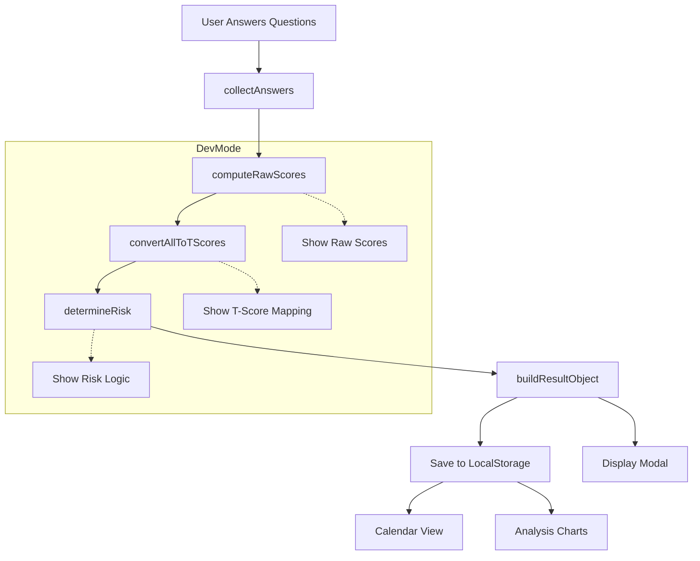

# CARS Refactor & Teaching Plan

Purpose: Make the codebase easier to teach to Grade 9 students, keep bilingual content, preserve current features (calendar + charts), stay 100% vanilla (GitHub Pages friendly), and introduce clearer structure + an optional Dev Mode.

---
## Guiding Principles
- Progressive disclosure: students can follow a simple pipeline.
- Separation of concerns: data, scoring logic, UI rendering, storage.
- Bilingual permanence: keep English + Filipino together in a structured data object (no student editing needed).
- Zero build tooling: plain `.html` + multiple `<script src>` files (optionally `type="module"` if desired).
- Maintain current behavior and visual output (except semantic markup tweaks).
- Add semantic HTML where low/no cost.
- Provide Dev Mode panel for transparency (calculations & intermediate steps) without cluttering normal UI.

---
## High-Level Architecture (Target)
```
index.html
styles.css (optional custom overrides)
/js/
  data.js          (questions, scales, rating options, normative tables, constants)
  scoring.js       (pure functions: collectAnswers, computeRaw, convertT, classifyRisk, buildResult)
  storage.js       (load, save, exportJSON, exportCSV, importJSON, deleteAll)
  ui_questionnaire.js (renderQuestionnaire)
  ui_modal.js      (show/hide result modal)
  ui_calendar.js   (renderCalendar)
  ui_analysis.js   (charts init/update)
  devmode.js       (Dev Mode toggle + panel rendering)
  main.js          (wires events, orchestrates flow)
```
Module Style Decision (Approved Hybrid):
- Primary: Global namespace (`window.CARS`) for clarity to Grade 9 learners.
- Secondary (advanced example in README): ES Module snippet demonstrating `import` usage.

---
## Mermaid Flow (Draft)

(Will move to `README.md` in implementation phase.)

---
## Task Checklist
### Phase 0: Pre-Refactor Validation (Completed Decisions Logged)
- [x] Module style hybrid approach selected
- [x] Dev Mode toggle: navbar button + optional Ctrl+D + #dev hash
- [x] Function decomposition of `calculateResults` approved
- [ ] Finalize Dev Mode panel exact section order & labels (minor)

### Phase 1: Prepare Repository Structure
- [ ] Create `js/` directory and placeholder files
- [ ] Extract constant data (questions, scales, tables, thresholds) into `data.js`
- [ ] Add semantic markup adjustments in `index.html` (fieldset/legend for questions, section/article where suitable)
- [ ] Keep bilingual text exactly as-is inside data objects

### Phase 2: Core Logic Extraction
- [ ] Move scoring-related logic into `scoring.js`
- [ ] Implement pure functions:
  - [ ] `collectAnswers(formEl)`
  - [ ] `computeRawScores(answers, scales)`
  - [ ] `convertRawToTScore(scale, raw, table)` (single responsibility)
  - [ ] `convertAllToTScores(rawScores, table)`
  - [ ] `determineRisk(tScores, hasSelfHarm)`
  - [ ] `buildResult(...)` (final result aggregator)
  - [ ] `calculateResultPipeline(formEl)` wrapper (temporary compatibility)
- [ ] Add basic input validation and defensive checks (console warnings only)

### Phase 3: UI Layer Separation
- [ ] `ui_questionnaire.js`: build/render questionnaire (radio groups, bilingual text)
- [ ] `ui_modal.js`: modal content builder (avoid string duplication)
- [ ] `ui_calendar.js`: calendar rendering (consume stored assessments)
- [ ] `ui_analysis.js`: chart setup & update functions
- [ ] Add minimal CSS tweaks (if needed) to `styles.css`

### Phase 4: Storage & Data Management
- [ ] `storage.js`: functions (`loadAssessments`, `saveAssessments`, `exportJSON`, `exportCSV`, `importJSON`, `deleteAllData`)
- [ ] Ensure unchanged data format for backwards compatibility

### Phase 5: Dev Mode Feature
- [ ] Add toggle button (navbar right side) to enable/disable
- [ ] `devmode.js`: when active, show collapsible panel containing:
  - [ ] Latest raw answers array
  - [ ] Raw scores per scale
  - [ ] T-score mapping table row highlight
  - [ ] Risk classification inputs & output
- [ ] Provide simple copy-to-clipboard JSON for the last result
- [ ] Hide all Dev elements by default (CSS class `is-hidden`)

### Phase 6: Integrate Orchestrator (`main.js`)
- [ ] Initialize data & load previous assessments
- [ ] Wire event listeners (submit, nav switches, exports, imports, delete)
- [ ] Connect pipeline: answers → scoring → storage → UI updates
- [ ] Ensure charts & calendar update only when needed

### Phase 7: Semantic & Accessibility (Lite)
- [ ] Replace generic `div` with `<main>`, `<section>`, `<header>`, `<nav>` where appropriate
- [ ] Wrap question radios in `<fieldset><legend>`
- [ ] Add `<table>` caption for results
- [ ] (Defer ARIA roles for later phase)

### Phase 8: README & Documentation
- [ ] Create `README.md` (overview, how it works, privacy, teaching steps)
- [ ] Include Mermaid flowchart
- [ ] Add “Teaching Progression” section (12-step incremental build outline)
- [ ] Add Dev Mode explanation

### Phase 9: Quality & Consistency
- [ ] Manual test: new assessment flow unaffected
- [ ] Manual test: calendar still clickable & correct
- [ ] Manual test: charts render existing history
- [ ] Manual test: import/export parity with old format
- [ ] Verify academic table correction (raw 4 → 46) persists
- [ ] Check no console errors in normal mode
- [ ] Check no global variable leaks besides intentional namespace

### Phase 10: Optional Nice-to-Haves (If Time)
- [ ] Add simple in-browser self-check script (validation of scales/keys)
- [ ] Provide color legend for risk bands on charts
- [ ] Add localStorage versioning key (for future migration)
- [ ] Provide print-friendly stylesheet for results modal

---
## Dev Mode Detail (Proposed)
Panel Sections (Approved Draft):
1. Answers (index + value)
2. Raw Scores (per scale)
3. T-Score Mapping (scale → raw → T)
4. Risk Logic (thresholds + decision path)
5. Result JSON (readonly + copy)

Toggle Mechanisms (choose one):
- A. Navbar button [Dev Mode] (recommended simplicity)
- B. Keyboard shortcut (e.g., `Ctrl+D`) adds convenience
- C. URL hash (#dev) auto-enables on load

---
## Remaining Minor Clarifications
If any adjustments to Dev Mode labels or ordering are desired, note them before Phase 5 begins.

---
## Rollout Strategy
- Keep existing `index.html` functioning until all modules are ready.
- Introduce new files and gradually migrate logic behind a feature flag (optional) or switch in a single commit to avoid half-broken state.
- Final pass removes large inline script and replaces with ordered `<script src="js/...">` tags.

---
## Risk Mitigation
- Back up current `index.html` before large extraction.
- After each phase, manually test core flow (submit → modal → calendar → analysis).
- Avoid renaming data keys used in saved localStorage to preserve user history.

---
## Teaching Progression (Summary)
1. Render static question
2. Loop questions
3. Capture answers
4. Compute one scale
5. Compute all scales
6. Add T-score mapping
7. Add risk classification
8. Store history
9. Render calendar
10. Add charts
11. Add export/import
12. Add Dev Mode

---
## Acceptance Criteria
- All existing functionality intact
- Code split into logical files
- Bilingual text preserved exactly
- Dev Mode off by default, on-demand transparency
- README includes mermaid flowchart & teaching steps

---
Please review clarifications & checklist. After confirmation, implementation will start Phase 0 → Phase 1.
