# Diagram Plan for CARS SSR

Created: November 9, 2025

This document defines what diagrams we will include, how we will lay out sources and outputs, the multi-format strategy (Mermaid, Graphviz DOT, PlantUML, D2), and where each PNG will be embedded in our Markdown docs for Grade 9 students. You will run the converter; this plan provides the exact source code blocks and the target PNG filenames.

---

## Source and Output Layout

- Sources live under: `docs/diagrams/<topic>/`
- For each topic we include multiple formats and levels:
  - Levels: `beginner`, `intermediate` (student-facing), and `advanced` (teacher-only)
  - Formats: prefer Mermaid; include DOT fallback; add PlantUML or D2 where useful
- Output PNG naming convention: `<topic>--<format>--<level>.png`

Example (Architecture topic):
- Sources:
  - `docs/diagrams/architecture/architecture.mmd`
  - `docs/diagrams/architecture/architecture.dot`
  - `docs/diagrams/architecture/architecture.puml`
- Outputs:
  - `docs/diagrams/architecture/architecture--mermaid--beginner.png`
  - `docs/diagrams/architecture/architecture--dot--beginner.png`
  - `docs/diagrams/architecture/architecture--plantuml--intermediate.png`

Color/style: neutral Bulma-like colors when supported (primary/info/success/warning/danger tones). Orientation: LR (left-to-right) for flows; TB (top-to-bottom) for trees.

---

## Embedding Strategy (Markdown)

We embed PNGs (not live diagram code) in:
- `inceptions/plan-SSR.md` (student plan): Beginner and some Intermediate diagrams
- `docs/ARCHITECTURE.md` (deep dive): Intermediate and Advanced diagrams
- `SSR/DEPLOYMENT.md` (ops): Deployment and debugging diagrams

Each embedded image includes:
- Alt text (clear sentence for accessibility)
- A short caption (Figure X: Title)

---

## Batch 1 (Foundational) — Diagram Sources

Included topics: Architecture, SSR Request Lifecycle, ER Diagram, Scoring Algorithm Flow.

You will save each code block to the indicated path, then render PNGs following the naming convention.

### 1) Architecture (Client ↔ Server ↔ DB)

Files:
- `docs/diagrams/architecture/architecture.mmd` (Mermaid, Beginner)
- `docs/diagrams/architecture/architecture.dot` (Graphviz DOT, Beginner fallback)
- `docs/diagrams/architecture/architecture.puml` (PlantUML Component, Intermediate)
- `docs/diagrams/architecture/architecture.d2` (D2, Intermediate alternative)

Mermaid (Beginner) — save as `docs/diagrams/architecture/architecture.mmd`:

```mermaid
flowchart LR
  classDef client fill:#d0ebff,stroke:#228be6,color:#1c7ed6;
  classDef server fill:#e6fcf5,stroke:#12b886,color:#099268;
  classDef view fill:#fff3bf,stroke:#f59f00,color:#b08900;
  classDef db fill:#ffe3e3,stroke:#fa5252,color:#c92a2a;

  Browser[Browser (Student/Counselor)]:::client
  Express[Express Server]:::server
  EJS[EJS Template Engine]:::view
  SQLite[(SQLite Database)]:::db

  Browser -- HTTP Request --> Express
  Express -- Render with data --> EJS
  EJS -- HTML --> Browser
  Express <-- SQL Queries --> SQLite

  %% Notes: Keep high-level for beginners
```

Graphviz DOT (Beginner) — save as `docs/diagrams/architecture/architecture.dot`:

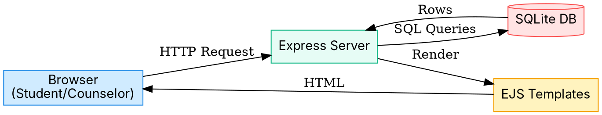

PlantUML Component (Intermediate) — save as `docs/diagrams/architecture/architecture.puml`:

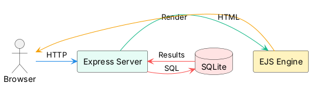

D2 (Intermediate) — save as `docs/diagrams/architecture/architecture.d2`:

```d2
direction: right

Browser: {
  label: "Browser\n(Student/Counselor)"
}
Express: {
  label: "Express Server"
}
EJS: {
  label: "EJS Templates"
}
SQLite: {
  shape: cylinder
  label: "SQLite DB"
}

Browser -> Express: "HTTP Request"
Express -> EJS: "Render"
EJS -> Browser: "HTML"
Express -> SQLite: "SQL"
SQLite -> Express: "Rows"
```

Expected outputs:
- `docs/diagrams/architecture/architecture--mermaid--beginner.png`
- `docs/diagrams/architecture/architecture--dot--beginner.png`
- `docs/diagrams/architecture/architecture--plantuml--intermediate.png`
- `docs/diagrams/architecture/architecture--d2--intermediate.png`

---

### 2) SSR Request Lifecycle (Sequence)

Files:
- `docs/diagrams/lifecycle/lifecycle.mmd` (Mermaid, Beginner)
- `docs/diagrams/lifecycle/lifecycle.puml` (PlantUML Sequence, Intermediate)
- `docs/diagrams/lifecycle/lifecycle.dot` (DOT, Fallback)

Mermaid (Beginner) — save as `docs/diagrams/lifecycle/lifecycle.mmd`:

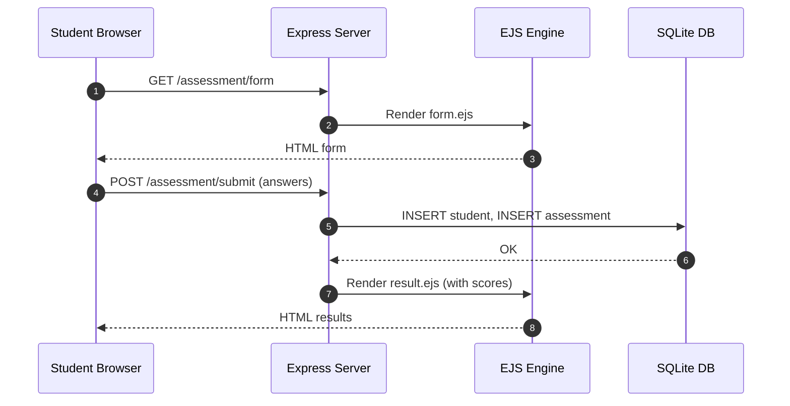

PlantUML Sequence (Intermediate) — save as `docs/diagrams/lifecycle/lifecycle.puml`:

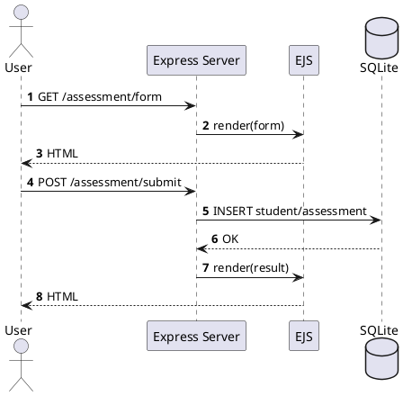

Graphviz DOT (Fallback Flow) — save as `docs/diagrams/lifecycle/lifecycle.dot`:

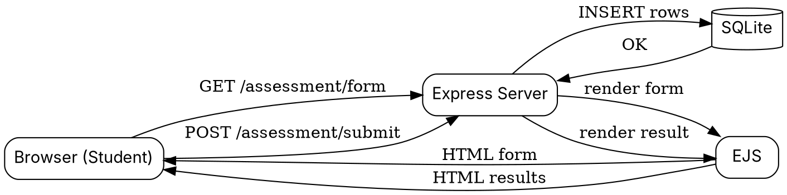

Expected outputs:
- `docs/diagrams/lifecycle/lifecycle--mermaid--beginner.png`
- `docs/diagrams/lifecycle/lifecycle--plantuml--intermediate.png`
- `docs/diagrams/lifecycle/lifecycle--dot--beginner.png`

---

### 3) Database ER Diagram

Files:
- `docs/diagrams/erd/erd.puml` (PlantUML Class/ER, Intermediate)
- `docs/diagrams/erd/erd.dot` (Graphviz DOT, Beginner)
- `docs/diagrams/erd/erd.mmd` (Mermaid Class, Fallback)

PlantUML (Intermediate) — save as `docs/diagrams/erd/erd.puml`:

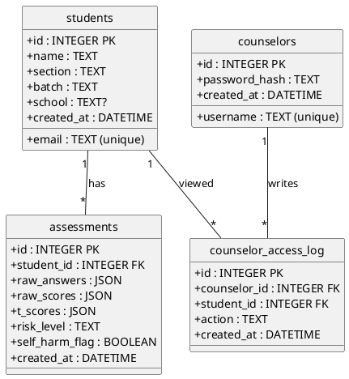

Graphviz DOT (Beginner) — save as `docs/diagrams/erd/erd.dot`:

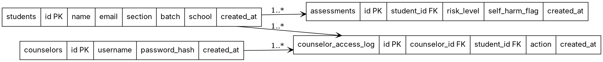

Mermaid Class (Fallback) — save as `docs/diagrams/erd/erd.mmd`:

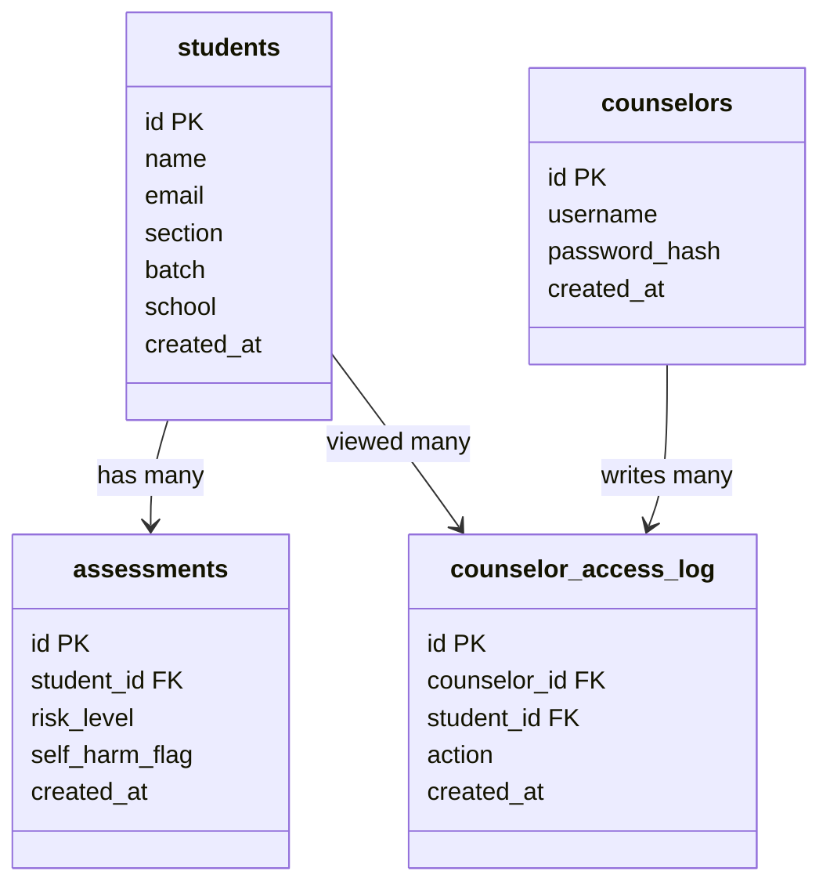

Expected outputs:
- `docs/diagrams/erd/erd--plantuml--intermediate.png`
- `docs/diagrams/erd/erd--dot--beginner.png`
- `docs/diagrams/erd/erd--mermaid--fallback.png`

---

### 4) Scoring Algorithm Flow

Files:
- `docs/diagrams/scoring/scoring.mmd` (Mermaid, Beginner)
- `docs/diagrams/scoring/scoring.dot` (Graphviz DOT, Beginner fallback)
- `docs/diagrams/scoring/scoring.puml` (PlantUML Activity, Intermediate)

Mermaid (Beginner) — save as `docs/diagrams/scoring/scoring.mmd`:

```mermaid
flowchart LR
  classDef step fill:#e6fcf5,stroke:#12b886,color:#099268;
  classDef decision fill:#fff3bf,stroke:#f59f00,color:#b08900;
  classDef end fill:#ffe3e3,stroke:#fa5252,color:#c92a2a;

  A[Collect 25 answers]:::step --> B[Compute raw subscale scores]:::step
  B --> C[Convert to T-scores (lookup tables)]:::step
  C --> D{Self-harm item (Q25) = Yes?}:::decision
  D -- Yes --> E[Set risk = High]:::end
  D -- No --> F[Determine risk by thresholds]:::step
  F --> G[Show results (per subscale + total)]:::step
```

Graphviz DOT (Beginner) — save as `docs/diagrams/scoring/scoring.dot`:

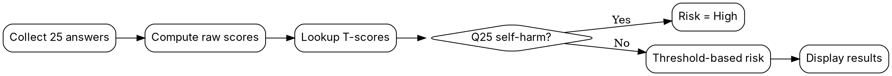

PlantUML Activity (Intermediate) — save as `docs/diagrams/scoring/scoring.puml`:

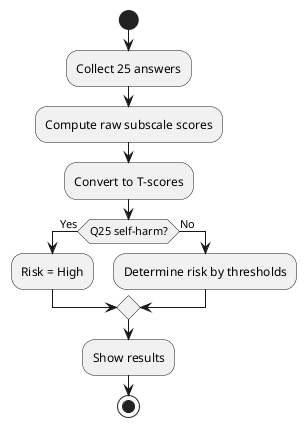

Expected outputs:
- `docs/diagrams/scoring/scoring--mermaid--beginner.png`
- `docs/diagrams/scoring/scoring--dot--beginner.png`
- `docs/diagrams/scoring/scoring--plantuml--intermediate.png`

---

## Batch 2 (Security/Operations) — Outline Only

This batch adds the full source blocks for:
- Authentication & Sessions (sequence)
- Deployment Pipeline to Railway (flow)
- Debugging Decision Tree (tree)

You will save each block to the indicated path, then render to PNGs using the established naming convention.

### 5) Authentication & Session Flow (Login → Session → Protected Route)

Files:
- `docs/diagrams/auth/auth.mmd` (Mermaid Sequence, Beginner)
- `docs/diagrams/auth/auth.puml` (PlantUML Sequence, Intermediate)
- `docs/diagrams/auth/auth.dot` (Graphviz DOT, Fallback)

Mermaid (Beginner) — save as `docs/diagrams/auth/auth.mmd`:

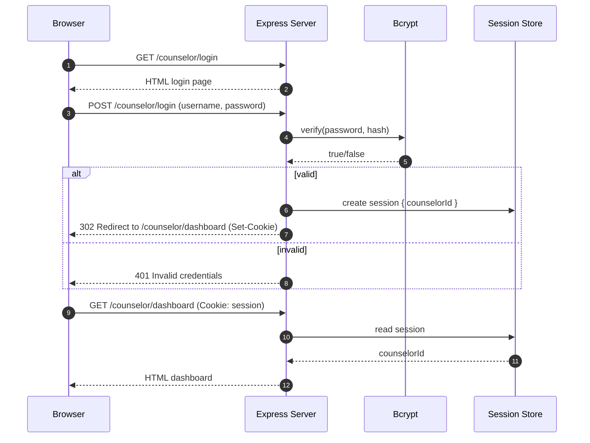

PlantUML Sequence (Intermediate) — save as `docs/diagrams/auth/auth.puml`:

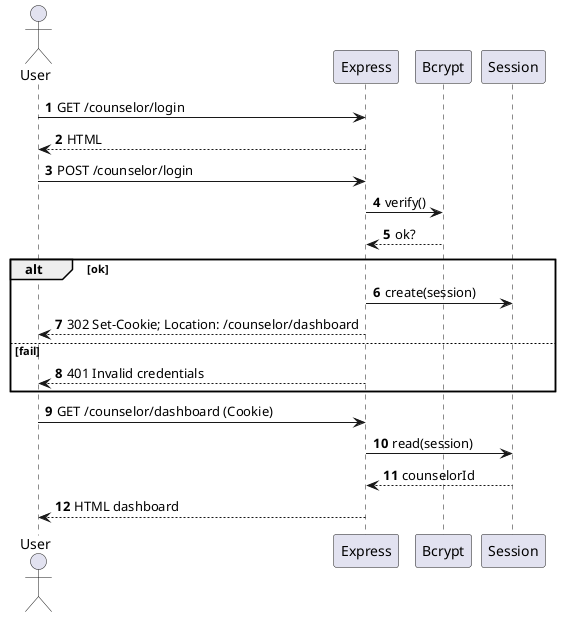

Graphviz DOT (Fallback Flow) — save as `docs/diagrams/auth/auth.dot`:

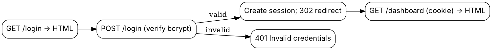

Expected outputs:
- `docs/diagrams/auth/auth--mermaid--beginner.png`
- `docs/diagrams/auth/auth--plantuml--intermediate.png`
- `docs/diagrams/auth/auth--dot--beginner.png`

---

### 6) Deployment Pipeline to Railway

Files:
- `docs/diagrams/deploy/deploy.mmd` (Mermaid Flow, Beginner)
- `docs/diagrams/deploy/deploy.dot` (Graphviz DOT, Beginner fallback)
- `docs/diagrams/deploy/deploy.puml` (PlantUML Activity, Intermediate)

Mermaid (Beginner) — save as `docs/diagrams/deploy/deploy.mmd`:

```mermaid
flowchart LR
  classDef step fill:#e6fcf5,stroke:#12b886,color:#099268;
  classDef warn fill:#fff3bf,stroke:#f59f00,color:#b08900;

  A[Git commit & push]:::step --> B[Railway builds (npm ci)]:::step
  B --> C[Run migrations]:::step
  C --> D[Start server]:::step
  D --> E{Seed run needed?}:::warn
  E -- Yes --> F[railway run npm run seed]:::step
  E -- No --> G[App live at URL]:::step
  F --> G
```

Graphviz DOT (Beginner) — save as `docs/diagrams/deploy/deploy.dot`:

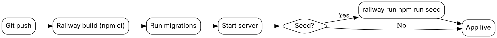

PlantUML Activity (Intermediate) — save as `docs/diagrams/deploy/deploy.puml`:

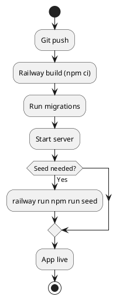

Expected outputs:
- `docs/diagrams/deploy/deploy--mermaid--beginner.png`
- `docs/diagrams/deploy/deploy--dot--beginner.png`
- `docs/diagrams/deploy/deploy--plantuml--intermediate.png`

---

### 7) Debugging Decision Tree (Common Errors → Checks)

Files:
- `docs/diagrams/debug/debug.mmd` (Mermaid Flow TB, Beginner)
- `docs/diagrams/debug/debug.dot` (Graphviz DOT TB, Beginner fallback)
- `docs/diagrams/debug/debug.puml` (PlantUML Activity, Intermediate)

Mermaid (Beginner, TB) — save as `docs/diagrams/debug/debug.mmd`:

```mermaid
flowchart TB
  classDef step fill:#e6fcf5,stroke:#12b886,color:#099268;
  classDef decision fill:#fff3bf,stroke:#f59f00,color:#b08900;
  classDef end fill:#ffe3e3,stroke:#fa5252,color:#c92a2a;

  A[Error message appears]:::step --> B{Is it a missing package?}:::decision
  B -- Yes --> B1[Run npm install]:::step
  B -- No --> C{Port 3000 in use?}:::decision
  C -- Yes --> C1[Stop other server / change port]:::step
  C -- No --> D{SQL error?}:::decision
  D -- Yes --> D1[Check schema & query; use DB Browser]:::step
  D -- No --> E{Auth error 401?}:::decision
  E -- Yes --> E1[Login again / check session]:::step
  E -- No --> F[Check server logs and console.log()]:::step
  B1 --> G[Retry]:::end
  C1 --> G
  D1 --> G
  E1 --> G
  F --> G
```

Graphviz DOT (Beginner, TB) — save as `docs/diagrams/debug/debug.dot`:

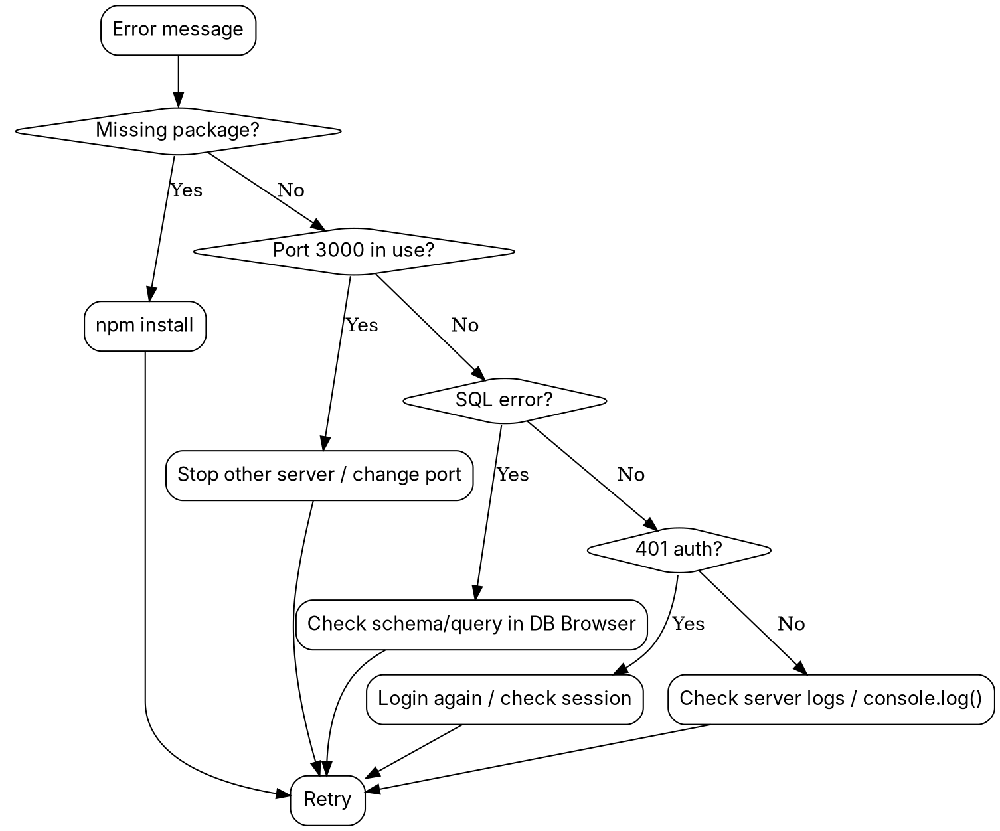

PlantUML Activity (Intermediate) — save as `docs/diagrams/debug/debug.puml`:

```plantuml
@startuml
start
:Error appears;
if (Missing package?) then (Yes)
  :npm install;
  -> Retry;
else (No)
  if (Port 3000 in use?) then (Yes)
    :Stop other server/change port;
    -> Retry;
  else (No)
    if (SQL error?) then (Yes)
      :Check schema/query in DB Browser;
      -> Retry;
    else (No)
      if (401 auth?) then (Yes)
        :Login again / check session;
        -> Retry;
      else (No)
        :Check logs and console.log();
        -> Retry;
      endif
    endif
  endif
endif
stop
@enduml
```

Expected outputs:
- `docs/diagrams/debug/debug--mermaid--beginner.png`
- `docs/diagrams/debug/debug--dot--beginner.png`
- `docs/diagrams/debug/debug--plantuml--intermediate.png`

---

## Embedding Map Updates (Batch 2)

- `inceptions/plan-SSR.md`
  - Phase 6 (Authentication): add Auth diagram — beginner PNG
  - Phase 9 (Deployment): add Deployment diagram — beginner PNG
  - Teaching Strategies → Debugging Boot Camp: add Debugging Tree — beginner PNG

- `SSR/DEPLOYMENT.md`
  - Use Deployment diagram (intermediate) near Step 2/3

- `docs/ARCHITECTURE.md`
  - Include intermediate versions for Auth and Debugging for teacher reference

---

## Embedding Map (Where images appear)

- `inceptions/plan-SSR.md`
  - Executive Summary (end): Architecture — beginner PNG
  - Phase 2 (Static Routes & Templates): SSR Lifecycle — beginner PNG
  - Phase 4 (Assessment Logic): Scoring Flow — beginner PNG
  - Phase 5 (Database Intro): ER Diagram — beginner PNG
  - Each with caption + alt text; link to intermediate version in docs

- `docs/ARCHITECTURE.md`
  - Architecture — intermediate PNG (+ alternative formats)
  - ER Diagram — intermediate PNG

- `SSR/DEPLOYMENT.md`
  - Deployment pipeline (to be added in Batch 2)
  - Debugging decision tree (to be added in Batch 2)

---

## Feasibility Check

- Scope: 4 foundational diagrams × 2–3 formats each is manageable in one pass.
- Render risk: Mermaid occasionally varies by renderer; DOT and PlantUML are robust fallbacks.
- Student fit: Beginner variants limit nodes to 7–10, matching Grade 9 cognitive load.
- Maintenance: Source alongside PNGs keeps regeneration easy when architecture evolves.
- Next: After confirming the PNGs render correctly on your converter, proceed with Batch 2.

No blockers expected. This plan is feasible and aligned with teaching goals.

---

## After You Render

Please generate PNGs to the specified filenames. Once the images exist, the embedded links in `plan-SSR.md` will render correctly.
